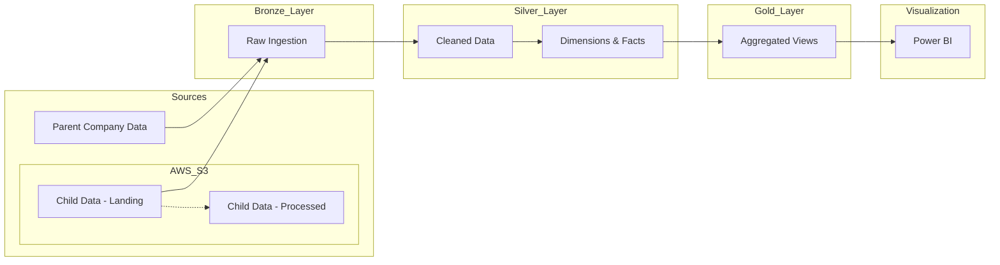

# FMCG Data Engineering Project using Databricks

## Overview

Built an end-to-end data engineering solution in the FMCG domain to enable unified analytics for a parent company and an acquired child company with fragmented data sources. Designed and implemented a scalable Lakehouse architecture using Databricks with Bronze, Silver, and Gold layers. Ingested raw data from CSV files into AWS S3 and processed it in Databricks by converting it into optimized Parquet and Delta formats for efficient storage and analytics. Merged Gold-layer datasets to create a consolidated, analytics-ready data foundation. Leveraged Delta Lake features such as schema enforcement, time travel, and change data feed to ensure data reliability, scalability, and support centralized BI reporting.

## Project Architecture

The project follows a standard ETL pipeline architecture:





1.  **Ingestion**: Raw data is ingested from multiple sources (Parent and Child companies).
2.  **Bronze Layer**: Raw data is stored in its original format.
3.  **Silver Layer**: Data is cleaned, validated, and normalized (Dimension and Fact tables).
4.  **Gold Layer**: Business-level aggregates and enriched views are created for reporting.
5.  **Dashboarding**: Insights are visualized using dashboards (e.g., `fmcg_dashboard.pdf`).

## Use Case

*   **Domain**: FMCG (Fast-Moving Consumer Goods)
*   **Goal**: Unified analytics for parent and child companies.
*   **Challenge**: Fragmented data sources (CSV/Parquet) and need for scalable storage.

## Technology Stack

*   **Cloud Platform**: AWS (S3 for raw storage), Databricks (Compute & Processing)
*   **Architecture**: Lakehouse (Bronze, Silver, Gold Medallion Architecture)
*   **Formats**: Parquet, Delta Lake (Optimized storage)
*   **Key Features**: Schema Enforcement, Time Travel, Change Data Feed
*   **Language**: Python (PySpark), SQL
*   **Orchestration**: Databricks Workflows
*   **Dashboarding**: Power BI

## Project Structure

The repository is organized as follows:

```text
.
├── 0_data/                         # Raw data files (CSV, Parquet, etc.)
│   ├── 1_parent_company/           # Data from the parent company
│   ├── 2_child_company/            # Data from child companies
│   └── Imp/                        # Important intermediate or reference data
├── 1_codes/                        # Source code notebooks
│   ├── 1_setup/                    # Setup scripts (Mounting, Catalog creation)
│   ├── 2_dimension_data_processing/# Notebooks for processing Dimension tables
│   ├── 3_fact_data_processing/     # Notebooks for processing Fact tables
│   └── scripts/                    # Utility scripts
├── 2_dashboarding/                 # Dashboarding resources and queries
│   ├── denormalise_table_query_fmcg.txt # SQL query for Gold layer view
│   └── fmcg_dashboard.pdf          # Sample output dashboard
├── resources/                      # Project assets (images, diagrams)
├── WORKFLOW.md                     # Detailed data pipeline workflow documentation
├── CONTRIBUTING.md                 # Guidelines for contributing
└── LICENSE                         # Project License
```

## Setup Instructions

1.  **Clone the Repository**:
    ```bash
    git clone https://github.com/yourusername/project-de-fmcg-atlikon.git
    ```

2.  **Import to Databricks**:
    *   Import the `1_codes` folder into your Databricks Workspace.

3.  **Data Setup**:
    *   Upload the contents of `0_data` to your Databricks File System (DBFS) or mount your S3/Blob Storage containing the data.
    *   Update the file paths in the `1_setup/utilities.ipynb` or relevant configuration notebooks to match your data location.

4.  **Run the Pipeline**:
    *   Execute the notebooks in the following order (or use the provided Workflow if available):
        1.  `1_setup/setup_catalog.ipynb` (to create databases/schemas)
        2.  `2_dimension_data_processing/*.ipynb` (to load Dimensions)
        3.  `3_fact_data_processing/*.ipynb` (to load Facts)
        4.  Run the Gold layer queries in `2_dashboarding`.

5.  **Connect Power BI**:
    *   This project uses Power BI for visualization.
    *   **Get Connection Details**: In your Databricks Workspace, go to **Compute** -> Select your Cluster -> **Advanced Options** -> **JDBC/ODBC**. Note the **Server Hostname** and **HTTP Path**.
    *   **Generate Token**: Go to **User Settings** -> **Developer** -> **Access Tokens** and generate a new Personal Access Token.
    *   **Configure Power BI**:
        *   Get Data -> Azure Databricks.
        *   Enter the **Server Hostname** and **HTTP Path**.
        *   Select "Import" or "Direct Query".
        *   Authentication: Use "Personal Access Token" and paste your generated token.


## Key Features

*   **Data Enrichment**: Merges data from disparate sources to create a unified view.
*   **Incremental Loading**: Handles incremental data updates for Fact tables.
*   **Data Quality**: Implements basic data cleaning and validation steps.
*   **Analytics Ready**: Produces a `vw_fact_orders_enriched` view optimized for BI tools.
